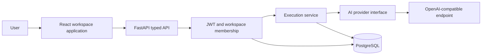

# Avrixo AI SaaS

### Multi-Tenant AI Operations Platform

A production-oriented AI SaaS reference implementation combining FastAPI,
PostgreSQL, React, workspace isolation, typed AI workflows, provider abstraction,
execution tracking, testing, and containerized deployment.

## Upstream & Fork Scope

This project is a customized derivative of [FastAPI’s Full Stack FastAPI Template](https://github.com/fastapi/full-stack-fastapi-template).

The original project, inherited architecture, Git history, and upstream
implementation remain credited to the original authors and contributors.
Avrixo-specific engineering work is documented in [FORK_CHANGES.md](FORK_CHANGES.md)
and [UPSTREAM.md](UPSTREAM.md). The [MIT license](LICENSE) and original copyright are preserved.

## What This Fork Adds

- Workspace and member data models with owner, admin and member roles.
- Workspace-scoped authorization, including for platform administrators.
- Typed workflow configuration, editor, status controls and model selection.
- An AI provider interface and a bounded OpenAI-compatible HTTP adapter.
- Persisted execution states, outputs, latency, safe errors and nullable token usage.
- Idempotent admission, per-workspace daily limits and concurrent execution limits.
- PostgreSQL constraints tying each execution to its workflow’s workspace.
- Database-backed dashboard, workspace overview, members, workflow runner and execution history UI.
- Tenant-isolation, role, provider, persistence and concurrency tests using fake providers.
- A real browser E2E flow with a separate test-only provider; no paid AI calls in CI.
- Generated TypeScript API contracts, migration validation, static checks and secret-pattern checks.

## Start locally

Prerequisites: Python 3.14, uv, Bun 1.3.12, Docker Compose and Git.

```bash
git clone https://github.com/arees412/avrixo-ai-saas.git
cd avrixo-ai-saas
git switch feat/avrixo-ai-saas
python scripts/setup_env.py
docker compose up -d --wait db mailpit
uv sync --frozen --all-packages
bun ci
cd backend
uv run alembic upgrade head
uv run python -m app.initial_data
uv run fastapi dev
```

In a second terminal:

```bash
cp frontend/.env.example frontend/.env
bun run dev
```

Open http://localhost:5173. The generated local `.env` contains the initial
administrator credentials. It is ignored by Git. Configure `AI_BASE_URL`,
`AI_API_KEY`, and `AI_DEFAULT_MODEL` there before running a real workflow.
The model must support chat completions, temperature and `max_tokens`.

See [development](docs/development.md) for Windows commands, tests, Docker,
provider setup and reproducible client generation.

## Design



See [architecture](docs/architecture.md) for tenancy, authorization, database
constraints, admission locking, lifecycle, failure handling and tradeoffs.

## Engineering boundaries

This is a reference implementation, not a claim of production customers,
enterprise certification, performance benchmarks or deployment readiness.
Execution is synchronous with durable status checkpoints; it is not a durable
background job queue. Provider credentials are managed per deployment, not per
workspace. Only the OpenAI-compatible adapter is implemented.

Usage limits govern admitted execution counts and output token requests; they
are not billing, currency budgets or guaranteed provider-side cost caps.
Reported tokens are summed only when the provider supplies usage.

Workspace isolation is enforced in application services/routes and relational
constraints, not PostgreSQL row-level security. Members of a workspace can read
its prompts and outputs. Operators must choose retention, backup, abuse-control
and provider-data policies before deploying. Interrupted runs require operator
reconciliation; they are never automatically retried against a paid provider.

## Inherited foundation

Authentication, password recovery, user administration, the generic Item demo,
base UI components, generated-client infrastructure, email templates and base
container architecture originated upstream. The Item demo remains accessible
at `/items` for compatibility; the product sidebar focuses on Workspaces.
Avrixo does not claim original authorship of that inherited code.
