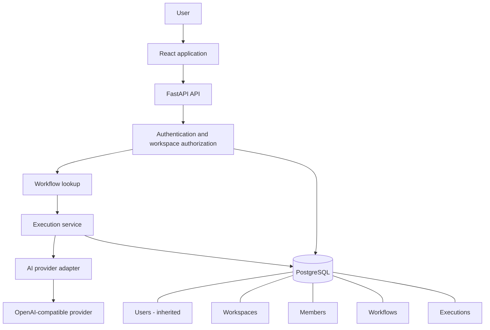
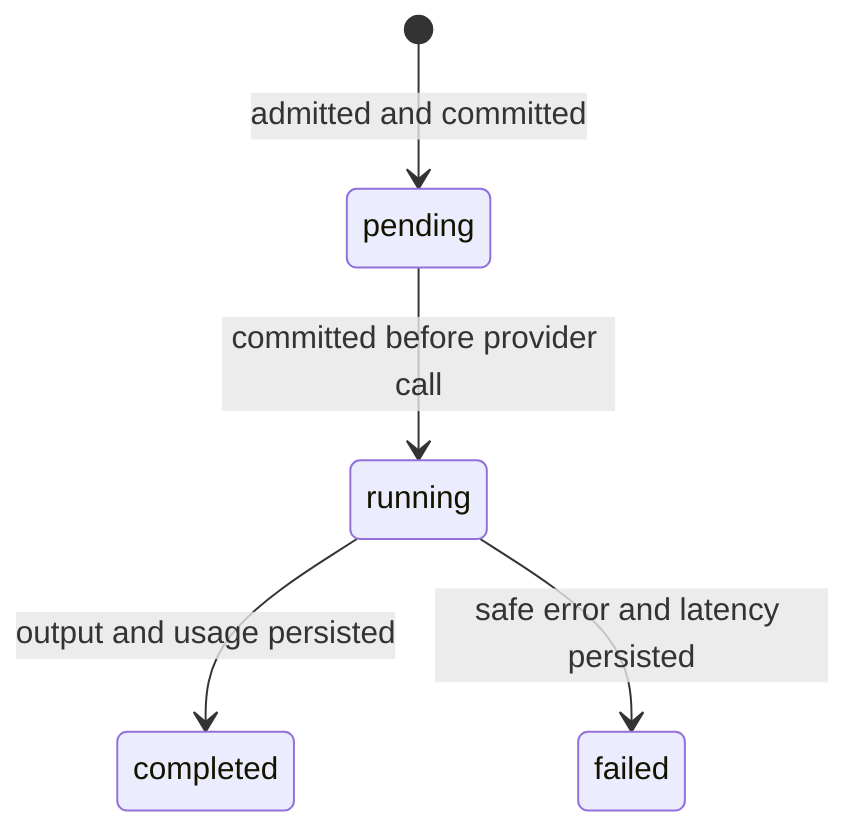

# Architecture

## Request and data boundaries

`app/operations/models.py` owns relational data, `schemas.py` the wire contracts,
`access.py` shared tenant checks, `routes.py` HTTP translation, `service.py`
execution admission/orchestration, and `providers.py` transport integration.
The domain registers with upstream SQLModel metadata so Alembic sees all tables.
Existing JWT/password/account services are reused and remain attributed upstream.

## Tenancy and authorization

Users have many workspace memberships. A membership’s composite primary key
prevents duplicates. Creating a workspace and its owner membership is atomic.
Workspace slugs are globally unique and return a generic conflict on collision.
Unknown and inaccessible workspace resources both return 404. Platform
superusers do not bypass workspace membership checks.

| Action | Owner | Admin | Member |
| --- | --- | --- | --- |
| Read workspace, workflows, members and executions | Yes | Yes | Yes |
| Execute active workflows | Yes | Yes | Yes |
| Create/edit/disable workflows | Yes | Yes | No |
| Add/remove ordinary members | Yes | Yes | No |
| Promote/demote/remove admins | Yes | No | No |
| Change daily/concurrent limits | Yes | No | No |
| Change/remove owner membership | No | No | No |

Membership edits serialize on the workspace row and recheck the acting role.
The owner ID is immutable through this API. Owner accounts cannot be deleted;
ownership transfer/workspace deletion need a separately designed lifecycle.
All workspace members can see workspace prompts and outputs. There are no
private executions within a shared workspace.

## Provider abstraction

`AIProvider` exposes `generate` and `health_check`; `Generation` carries text
and optional usage. Routes depend on the interface through FastAPI injection.
The implemented adapter accepts an operator-managed base URL and secret key.
Neither is stored in workspace rows nor returned to the frontend. Discovery
returns only adapter ID, configured status and a default model hint.

Remote endpoint URLs require HTTPS and cannot contain embedded credentials,
queries or fragments. Loopback HTTP and the explicit Compose test fixture are
supported. Redirects are disabled. The adapter bounds input through schemas,
output token requests, response size and HTTP timeouts. It accepts chat
completion endpoints that support string message content, temperature and
`max_tokens`; other provider dialects need another adapter.

## Execution lifecycle and admission

Admission locks the PostgreSQL workspace row, rechecks membership, checks for
an existing `(workspace_id, created_by, idempotency_key)`, verifies workflow
status and counts daily/in-flight executions. A replay returns the original
record; reusing a key for different input/workflow returns 409. Limits return
429 before calling the provider. All admitted attempts, including failed ones,
count against the UTC daily limit. There is no automatic paid-provider retry.

The configuration is snapshotted before releasing the admission lock.
The database transaction is not held open during network generation. Calls
run synchronously in FastAPI’s thread pool. A duplicate while the first call is
active returns its pending/running record; the UI polls execution detail.

## Persistence and observability

Each execution stores workflow/workspace IDs, provider/model, input/output,
creator, status, timestamps, latency and nullable token counts. A composite
foreign key enforces that workflow and workspace IDs agree. Workspaces cascade
to their domain records; deleted non-owner users become null creator IDs in
history. Database checks enforce role/state vocabulary and numeric bounds.

Metrics are SQL aggregates restricted to the caller’s membership IDs. Usage
coverage is returned with totals so missing usage is visible. This is not a
billing ledger and is not a provider-cost guarantee.

Execution logs contain IDs, status and latency only. Provider body/exception
strings, prompts, outputs and credentials are omitted. Failure records use
application-owned error codes. Health checks are transport checks, not proof
that a model can complete requests; they are not exposed as a paid API action.

## Failure handling and operational limits

If a process terminates between checkpoints, an execution can remain pending
or running. There is no durable queue, lease renewal or automatic recovery.
An operator must verify the worker/provider state before marking an abandoned
run failed in the database; blindly retrying may create a second billable call.
Such runs continue occupying admission slots until reconciled.

Authorization is application-level with database integrity constraints, not
PostgreSQL RLS. Additional production work includes retention/deletion and
ownership transfer, workspace creation/rate abuse controls, audit events,
backup/restore drills, load testing, deployment-specific network controls,
worker recovery and provider-specific policy review. Existing upstream account
authentication/admin capabilities retain their own original design boundaries.
